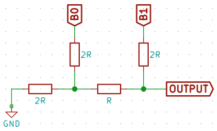

# UX2: Universal Extension Bus

> UNDER CONSTRUCTION - LIABLE TO CHANGE

UX2 is an open source, connector-agnostic, board-to-board communication bus which supports the following protocols (depending on pin variant):

* [GPIO](https://www.wikiwand.com/en/General-purpose_input/output) – General Purpose Input/Output
* [1-Wire](https://www.wikiwand.com/en/1-Wire) – for lowest possible wire count to remote circuits or sensors
* [Interrupt](https://www.wikiwand.com/en/Interrupt) – wake master/host MCU via slave/module triggered interrupt
* [UART](https://www.wikiwand.com/en/Universal_asynchronous_receiver/transmitter) / [Async](https://www.wikiwand.com/en/Asynchronous_serial_communication) - serial communication bus
* [I2C](https://www.wikiwand.com/en/I%C2%B2C)
* [SPI](https://www.wikiwand.com/en/Serial_Peripheral_Interface_Bus)
* [Sound-Wire](https://www.mipi.org/specifications/soundwire)

## Quick Reference

There are four variants which determine the function of the outer pins...

**UX2-GPIO** – four GPIO  

**UX2-ALT** – two GPIO, one addtional I2C  

**UX2-1IS** – 1-Wire, Interrupt and Sound-Wire  

**UX2-I2C** – two additional I2C  

### Pin reference

* `1W` – **1-Wire** data pin, to be used in conjunction with the `GND` pin
* `INT` – **Interrupt**, allowing sensors to trigger an interrupt on host/master MCU
* `Gx` - **GPIO**, where `x` is interface number; `0`, `1`, `2`, `3`
* `GND` – **Ground** pin (0V)
* `3V3` – **3.3V** power output from master; max current draw is implementation-dependent
* `RXD`, `TXD` – **UART / Async** interface
    * Note: Pins should be swapped on slave/module boards (eg. `Tx` from master goes to `Rx` on slave)
* `SDAx`, `SCLx` – **I2C** interfaces, where `x` is interface number; `0`, `1`, `2`
* `MOSI`, `MISO`, `SSEL` (slave select), `SCK` - **SPI** interface
* `SWD`, `SWC` – **Sound-Wire** interface

### Pin variant selection

There are two common ways to set the pin variant:

1. Hard-code via firmware on the MCU
2. Physical jumpers or dip switches (see below)

Two bits (`B0`, `B1`) are required to represent the 4 possible pin variants; easily achieved with jumpers or dip switches:

| B0 | B1 |  Pinout  |
| -- | -- | -------- |
| 0  | 0  | UX2-GPIO |
| 0  | 1  | UX2-ALT  |
| 1  | 0  | UX2-1IS  |
| 1  | 1  | UX2-I2C  |

Read setting with only one MCU IO? Use [R-2R resistor ladder](https://www.wikiwand.com/en/Resistor_ladder#/R.E2.80.932R_resistor_ladder_network_.28digital_to_analog_conversion.29) [DAC](https://www.wikiwand.com/en/Digital-to-analog_converter) to merge digital bits in to single analog value:

## Compatibility

The UX2 bus is compatible with a range of 3rd party buses...

> **Note:** Remember UX2 is 3.3V based; higher voltages can damage host/master.

### UEXT, [Olimex UEXT modules](https://www.olimex.com/Products/Modules/)

A 7-way 2-row IDC socket (shown below) accommodates both 5x2 (UEXT) and 7x2 (UX2) IDC plugs.

>   
> 7x2 IDC socket viewed from above

As pin variants only affect the outer pins, which are external to the UEXT pins, you can safely use any of the pin variants whilst retaining full compatibility with UEXT.

The host/master board must ensure the UEXT pins adhere to the [UEXT specifications](https://www.olimex.com/Products/Modules/UEXT/resources/UEXT_rev_B.pdf); for example, the `3V3` pin should be able to supply 100mA of current.

### [Adafruit breakout boards](https://www.adafruit.com/category/42)

**UX2-GPIO pin variant** with the following wiring:

* `3V3` usually connects to breakout `Vin` or `Vcc`
* `GND` connects to breakout `GND`
* Connect Async, I2C and SPI interfaces to breakout, where applicable
* For any remaining connections, use the GPIO (`Gx`) pins

### [Sparkfun sensor boards](https://www.sparkfun.com/categories/23)

**UX2-GPIO pin variant** with the following wiring:

* `3V3` usually connects to sensor `3V3` or `Vcc`
* `GND` connects to sensor `GND`
* Connect Async, I2C and SPI interfaces to breakout, where applicable
* For any remaining connections, use the GPIO (`Gx`) pins

To connect multiple Sparkfun sensors, favour those that have I2C or SPI as they allow chaining.

### [DFRobot Gravity modules](https://www.dfrobot.com/category-36.html)

**UX2-GPIO pin variant**, which allows 4 Gravity modules with the following wiring:

* `Gx` (GPIO) connects to the Gravity outer green wire (Signal)
* `3V3` connects to the Gravity middle red wire (Voltage or Vcc)
* `GND` connects to the Gravity outer black wire (Ground)

A common bus format for Gravity modules is to have three rows of male header (green, red, black) with each column (3 pins) being an interface to a single Gravity module.

### I2C devices

Any of the pin variants will suffice, unless you need additional I2C buses in which case use **UX2-I2C pin variant**.

Note: An alternative to multiple I2C interfaces is to use an [I2C address changer](http://hackaday.com/2017/02/17/ltc4316-is-the-i2c-babelfish/)

Remember to keep track of power consumption on the `3V3` pin, and if you are having problems with long wires [try this](http://hackaday.com/2017/02/08/taking-the-leap-off-board-an-introduction-to-i2c-over-long-wires/).

### 1-Wire devices

**UX2-1IS pin variant**, with the following wiring:

* `1W` connects to the `1-Wire` pin on the device
* `GND` connects to the `GND` pin on the device

1-Wire devices usually operate at either 3V or 5V. As such, the 3.3V offered by UX2 bus might need stepping up or down to accommodate. 1-Wire devices are often powered by putting an 800pF capacitor between their `1-Wire` and `GND` pins.

### Sound-Wire components

**UX2-1IS pin variant**, with following wiring:

* `SWD` connects to `Data`
* `SWC` connects to `Clock` or `Clk`

Note: In circuit schematics, the clock connections are often omitted for sake of clarity (focus is on the data); the clock connection is always required regardless.

### RS232, RS485, IRDA, USB, SD/MMC

Use the UEXT bus (see UEXT section above) in conjunction with [Olimex Interface Modules](https://www.olimex.com/Products/Modules/Interface/).

Any pin variant can be used as they don't affect the UEXT pins.

## License

See [License](./LICENSE).
