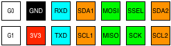
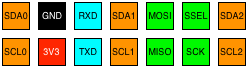
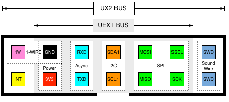

# UX2: Universal Extension Bus

> UNDER CONSTRUCTION - LIABLE TO CHANGE

UX2 is an open source, connector-agnostic, board-to-board communication bus which supports the following protocols (depending on pin variant):

* [GPIO](https://www.wikiwand.com/en/General-purpose_input/output) – General Purpose Input/Output
* [1-Wire](https://www.wikiwand.com/en/1-Wire) – for lowest possible wire count to remote circuits or sensors
* [Interrupt](https://www.wikiwand.com/en/Interrupt) – wake master/host MCU via slave/module triggered interrupt
* [Async](https://www.wikiwand.com/en/Asynchronous_serial_communication)
* [I2C](https://www.wikiwand.com/en/I%C2%B2C)
* [SPI](https://www.wikiwand.com/en/Serial_Peripheral_Interface_Bus)
* [Sound-Wire](https://www.mipi.org/specifications/soundwire)

## Quick Reference

There are four variants which determine the function of the outer pins...

**UX2-GPIO** – four GPIO  

**UX2-ALT** – two GPIO, one addtional I2C  

**UX2-1IS** – 1-Wire, Interrupt and Sound-Wire  

**UX2-I2C** – two additional I2C  

### Pin reference

* `1W` – 1-Wire data pin, to be used in conjunction with the `GND` pin
* `INT` – Interrupt, allowing sensors to trigger an interrupt on host/master MCU
* `Gx` - GPIO, where `x` is interface number (`0`, `1`, `2`, `3`) depending on pin variant
* `GND` – Ground pin (0V)
* `3V3` – 3.3V power supply; max 100mA draw (UX2, UEXT) or implementation-dependent (Micro UX2)
* `RXD`, `TXD` – Async interface
* `SDAx`, `SCLx` – I2C interface, where `x` is interface number (`0`, `1`, `2`) depending on pin variant
* `MOSI`, `MISO`, `SSEL` (slave select), `SCK` - SPI interface
* `SWD`, `SWC` – Sound-Wire interface

### Pin variant selection

There are two common ways to set the pin variant:

1. Hard-code via firmware on the MCU
2. Physical jumpers or dip switches (see below)

With 4 variants, it is possible to allow on-board variant selection with just two jumpers or dip switches connected to host MCU:

* 0 0 = UX2-GPIO
* 0 1 = UX2-ALT
* 1 0 = UX2-1IS
* 1 1 = UX2-I2C

If you set up the circuit so that the four selections equate to specific voltages (eg. 0V, 1V, 2V, 3V) you would only need one ADC or GPIO pin on the MCU to determine the value of both jumpers.

## Compatibility

The UX2 bus is compatible with a range of 3rd party buses...

> **Note:** Remember that UX2 is 3.3V based; don't connect to 5V rails as you risk causing damage to the host/master!

### [Olimex UEXT modules](https://www.olimex.com/Products/Modules/)

A 7-way 2-row IDC socket should be used to accommodate an applicable connector plug as shown below:

This ensures a 5x2 pin UEXT connector is inserted correctly in the middle of the 7x2 UX2 socket. Alternatively, you could use a 5x2 socket and plug, and separate out the four outer UX2 pins (maybe with additional `GND` next to the `1W` if applicable).

As pin variants only affect the outer pins, which are external to the UEXT bus, you can safely use any of the pin variants whilst retaining full compatibility with UEXT.

The host/master board must ensure the UEXT pins adhere to the [UEXT specifications](https://www.olimex.com/Products/Modules/UEXT/resources/UEXT_rev_B.pdf); for example, the `3V3` pin should be able to supply 100mA of current.

### [Adafruit breakout boards](https://www.adafruit.com/category/42)

Use the **UX2-GPIO pin variant** with the following wiring:

* `3V3` usually connects to breakout `Vin` or `Vcc`
* `GND` connects to breakout `GND`
* Connect Async, I2C and SPI interfaces to breakout, where applicable
* For any remaining connections, use the GPIO (`Gx`) pins

### [Sparkfun sensor boards](https://www.sparkfun.com/categories/23)

Use the **UX2-GPIO pin variant** with the following wiring:

* `3V3` usually connects to sensor `3V3` or `Vcc`
* `GND` connects to sensor `GND`
* Connect Async, I2C and SPI interfaces to breakout, where applicable
* For any remaining connections, use the GPIO (`Gx`) pins

Remember that the GPIO pins can only be used once. For example, you can't connect `G0` to 3 different sensor boards, you can only connect it to one board. Similarly, the Async interface can only be connected to at most one board.

If you want to connect lots of Sparkfun sensors, try and use boards that rely exclusively on I2C or SPI as those protocols are chainable. Depending on which boards you use, you might find the **UX2-I2C pin variant** a better match for your needs.

### [DFRobot Gravity modules](https://www.dfrobot.com/category-36.html)

Use the **UX2-GPIO pin variant**, which will allow you to connect up to 4 Gravity modules with the following wiring:

* `Gx` (GPIO) connects to the Gravity outer green wire (Signal)
* `3V3` connects to the Gravity middle red wire (Voltage or Vcc)
* `GND` connects to the Gravity outer black wire (Ground)

A common bus format for Gravity modules is to have three rows of male header (green, red, black) with each column (3 pins) being an interface to a single Gravity module.

### I2C devices

If you require separate I2C interfaces (eg. to different sections of a circuit, or because you have multiple components with the same I2C ID), use the **UX2-I2C pin variant**, otherwise use one of the other variants.

When chaining multiple I2C devices on the same interface, remember to keep track of power consumption on the `3V3` pin.

### 1-Wire devices

Use the **UX2-1IS pin variant**, with the following wiring:

* `1W` connects to the `1-Wire` pin on the device
* `GND` connects to the `GND` pin on the device

1-Wire devices usually operate at either 3V or 5V. As such, the 3.3V offered by UX2 bus might need stepping up or down to accommodate. 1-Wire devices are often powered by putting an 800pF capacitor between their `1-Wire` and `GND` pins.

### Sound-Wire components

Use the **UX2-1IS pin variant**, with following wiring:

* `SWD` connects to `Data`
* `SWC` connects to `Clock` or `Clk`

Note: In circuit schematics, the clock connections are often omitted for sake of clarity (focus is on the data); the clock connection is always required regardless.

## License

See [License](./LICENSE).
