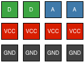

# Gravity Series (DFRobot)

> Gravity is an open source, plug and play toolkit with over 60 compatible modules which include sensors, motor controllers and human computer interaction devices.

* [Gravity Overview](https://www.dfrobot.com/gravity)
* [Gravity Modules](https://www.dfrobot.com/category-36.html)

## Pin variant

UX2-GPIO – 4 x GPIO:

## Wiring

There are two types of Gravity connector - Analogue (blue) and Digital (green), each using a 3 wire connector:

| UX2   | Gravity                   |
| ----- | ------------------------- |
| `Gx`  | `A` (blue) or `D` (green) |
| `3V3` | `VCC` (red)               |
| `GND` | `GND` (black)             |

As GPIO (`Gx`) can be either analog or digital, you can connect up to 4 Gravity modules to a UX2-GPIO.

## Host Considerations

Gravity hosts use color-coded male header. The illustration below shows 2 x Digital and 2 x Analog:

If you provide color-coded header, ensure that analog pins have ADC/DAC capability, and ensure that digital pins have PWM capability.
