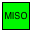
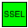

# UEXT (Olimex modules)

> Universal EXTension (UEXT) is a connector layout which includes power and three serial buses: UART/Async, I2C, and SPI. The connector layout was specified by Olimex Ltd and declared an open-project that is royalty-free.

* [Wikipedia Article](https://www.wikiwand.com/en/UEXT)
* [UEXT Modules](https://www.olimex.com/Products/Modules/UEXT/)

## Pin variants

As pin variants only affect the outer pins, which are external to the UEXT pins, you can safely use any of the pin variants whilst retaining full compatibility with UEXT.

UX2-GPIO – 4 x GPIO, 1 x UART, 1 x I2C, 1 x SPI:

UX2-I2C – 3 x I2C, 1 x UART, 1 x SPI:

UX2-ALT – 2 x GPIO, 1 x UART, 2 x I2C, 1 x SPI:

UX2-1IS – 1 x 1-WIRE, 1 x INTERRUPT, 1 x UART, 1 x I2C, 1 x SPI, 1 x SOUND-WIRE:

## Wiring

UEXT cabe should be attached to the centre 10x2 pins (leaving 1x2 pins either side; see diagram further down this page).

| UX2                          | UEXT              |
| ---------------------------- | ----------------- |
|     | `Vin`, `Vcc`      |
|     | `GND`             |
|     | `TXD` (not `RXD`) |
|     | `RXD` (not `TXD`) |
|    | `SDA`             |
|    | `SCL`             |
|   | `MISO`            |
|   | `MOSI`            |
|     | `SCK`             |
|   | `SSEL`            |

## Host Considerations

A 7-way 2-row IDC socket (shown below) accommodates both 5x2 (UEXT) and 7x2 (UX2) IDC plugs.

>   
> 7x2 IDC socket viewed from above, with UX2-1IS pin variant active

The host/master board must ensure the UEXT pins adhere to the [UEXT specifications](https://www.olimex.com/Products/Modules/UEXT/resources/UEXT_rev_B.pdf); for example, the `3V3` pin should be able to supply 100mA of current.

## See also

* [UX2 Overview](../../README.md)
* [Modules](../README.md)
* [Protocols](../../protocols/README.md)
