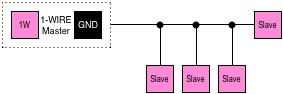
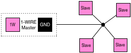

# 1-Wire

> 1-Wire is a device communications bus system which provides data, signaling, and power over a single conductor. It is similar in concept to I²C, but with lower data rates and longer range. It is typically used to communicate with small inexpensive devices such as digital thermometers and weather instruments.

* [Wikipedia article](https://www.wikiwand.com/en/1-Wire)
* [Manufacturer website](https://www.maximintegrated.com/en/products/digital/one-wire.html)

Note: 1-Wire is not suitable for low power hosts which rely on energy harvesting.

## Pin variant

The UX2-1IS pin variant includes a 1-Wire interface:

## Wiring

The 1-Wire interface actually comprises of two wires, `1W` (data and power) and `GND`:

| UX2                       | Slave                 |
| ------------------------- | --------------------- |
|    | `1-Wire` (data/power) |
|  | `GND`                 |

Slaves often operate at either 3V or 5V; you might require a voltage level translator (see [App Note 4477](https://www.maximintegrated.com/en/an4477) on manufacturer website for details).

## Topology

1-Wire facilitates several wiring topologies as summarised below. In many cases, a shielded CAT5 network cable will be suitable, especially for long distance networks (up to 100m).

> **Note:**  
> There are different electrical characteristics for each topology which can impair reliability if not properly managed (see [Tutorual 148](https://www.maximintegrated.com/en/app-notes/index.mvp/id/148) on the manufacturer website for details).

The **linear topology** has a main cable which stretches from the master to the farthest slave (sensor). Additional slaves are connected along the main cable, often by short stretches of wire:

The **stubbed topology** is similar to linear, but intermediate slaves are connected to the main wire by longer cables (usually with lengths in excess of 3m):

The **star topology** has slaves connected by cables to a central point:

It is also possible to create switched topologies, where different branches of slaves can be enabled or disabled via a switch in the 1-Wire cable.

## Host considerations

Because the `1W` pin is held high for most of the time, and slave devices will often parasitically leach power from it, the 1-Wire interface is not suitable for hosts which rely on energy harvesting.

It is strongly advised to use an MCU or FPGA which has hardware support for 1-Wire. Alternatively, there are dedicated 1-Wire driver ICs available from the manufacturer. For more details, please see [App Note 4206](https://www.maximintegrated.com/en/an4206) on the manufacturer website.

If the end-user is using both the 1-Wire and UEXT interfaces at the same time, the UEXT connector will consume the `GND` pin. As such, it's recommended to have an additional `GND` pin to the left of the `1W` pin.

## See also:

* [UX2 Overview](../../README.md)
* [Protocols](../README.md)
* [Modules](../../modules/README.md)
