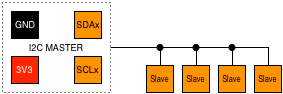

# I2C Protocol

> I²C (Inter-Integrated Circuit), pronounced I-squared-C or I-two-C, is a multi-master, multi-slave, packet switched, single-ended, serial computer bus.

* [Wikipedia Article](https://www.wikiwand.com/en/I%C2%B2C)
* [I2C Bus Specification](http://www.nxp.com/docs/en/user-guide/UM10204.pdf)
* [NXP I2C Portfolio](http://www.nxp.com/products/interfaces/ic-bus-portfolio:MC_41735) - extensive range of I2C ICs, sensors, etc.

## IMPORTANT

The I2C standard is based on 5V, but most devices these days are designed to work between 3.3V and 5V due to the growing trend towards lower power devices.

The UX2 Bus is based on an operating voltage of 3.3V and would likely be damaged by higher voltages.

If you encounter an I2C device that requires 5V, you can use a [Level Shifter](https://shop.controleverything.com/collections/bus-handlers/products/i2c-data-and-power-level-shifter-3vdc-to-5vdc-bus-handler) to safely interface to it.

If there is a risk of voltage spikes, you can use a [Power Isolator](https://shop.controleverything.com/collections/bus-handlers/products/iso1541-i2c-data-and-1kv-power-isolator-bus-handler-i2c-mini-module) which can protect against voltages up to 1KV.

## Pin Variants

UX2-GPIO – **1 x I2C**, 4 x GPIO, 1 x UART, 1 x SPI:

UX2-1IS – **1 x I2C**, 1 x 1-WIRE, 1 x INTERRUPT, 1 x UART, 1 x SPI, 1 x SOUND-WIRE:

UX2-ALT – **2 x I2C**, 2 x GPIO, 1 x UART, 1 x SPI:

UX2-I2C – **3 x I2C**, 1 x UART, 1 x SPI:

## Wiring

The I2C standard uses 4 wires; `SDA` (data), `SCL` (clock), `3V3` and `GND`:

| UX2                        | I2C           |
| -------------------------- | ------------- |
|  | `SDA` (data)  |
|  | `SCL` (clock) |
|   | `VCC`         |
|   | `GND`         |

It's important to use the same interface pair for each I2C bus. For example, if you're using the UX2-I2C pin variant which provides 3 x I2C interfaces, you could use `SDA1` and `SCL1` together as a pair, but not `SDA1` and `SCL2` (`SCL2` must be paired with `SDA2`).

Each interface pair (I2C Bus) can host multiple slave devices. Usually one I2C bus will suffice, but it can be useful to use more than one, for example if two devices have the same address you can put them on separate busses.

## Topology

An I2C bus can have several devices attached to it in a linear topology:

There are [multiplexer and switch ICs](http://www.nxp.com/products/interfaces/ic-bus-portfolio/ic-multiplexers-switches:MC_41851) which provide more advanced topologies should the need arise.

The maximal number of nodes is limited by the address space and also by the total bus capacitance of 400 pF, which restricts practical communication distances to a few meters.

There are [ICs which change I2C address](http://hackaday.com/2017/02/17/ltc4316-is-the-i2c-babelfish/) to help overcome cases where multiple devices with the same address are required.

You can extend the range of an I2C network using an [Extender Module](https://shop.controleverything.com/collections/bus-handlers/products/long-distance-i2c-bus-extender) (essentially a repeater node) or even with some [clever](http://hackaday.com/2017/02/08/taking-the-leap-off-board-an-introduction-to-i2c-over-long-wires/), [wiring](https://hackaday.com/2017/03/31/an-introduction-to-differential-i%C2%B2c/).

## See also:

* [SMBus](../smbus/README.md) – almost completely compatible with I2C.
* [Protocols Overview](../README.md)
* [UX2 Overview](../../README.md)
