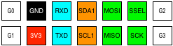
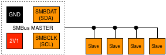

# SMBus

> The System Management Bus (abbreviated to SMBus or SMB) is a single-ended simple two-wire bus for the purpose of lightweight communication. It is derived from I²C for communication with low-bandwidth devices on a motherboard, especially power related chips such as a laptop's rechargeable battery subsystem; other devices might include temperature, fan or voltage sensors, lid switches and clock chips. PCI add-in cards may connect to an SMBus segment.

* [Wikipedia Article](https://www.wikiwand.com/en/System_Management_Bus)
* [SMBus Specification](http://smbus.org/specs/)

SMBus is almost completely compatible with I2C; the notable differences, including voltage, current and clock, can be found in the link below:

* [SMBus vs. I2C Comparison](https://www.maximintegrated.com/en/app-notes/index.mvp/id/476)

## IMPORTANT

The SMBus standard is based on 2.1V, whereas UX2 is based on 3.3V. You will need to use a level shifter, or reduce the UX2 voltage directly.

## Pin Variants

UX2 doesn't provide direct support for SMBus, but as it's practically compatible with I2C any of the I2C pin variants could be used...

UX2-GPIO – **1 x I2C**, 4 x GPIO, 1 x UART, 1 x SPI:

UX2-1IS – **1 x I2C**, 1 x 1-WIRE, 1 x INTERRUPT, 1 x UART, 1 x SPI, 1 x SOUND-WIRE:

UX2-ALT – **2 x I2C**, 2 x GPIO, 1 x UART, 1 x SPI:

UX2-I2C – **3 x I2C**, 1 x UART, 1 x SPI:

## Wiring

The I2C standard uses 4 wires; `SDA` (data), `SCL` (clock), `3V3` and `GND`:

| UX2                        | SMBus                            |
| -------------------------- | -------------------------------- |
|  | `SMBDAT` (data)                  |
|  | `SMBCLK` (clock)                 |
|   | _Incompatible, use 2.1V instead_ |
|   | `GND`                            |

## Topology

Like I2C, SMBus can have several devices attached to it in a linear topology:

SMBus is designed for use within a circuit board, rather than remote sensing or inter-device comms; wire lengths should be kept short. If you need longer range, use [I2C](../i2c/README.md) instead.

## See also:

* [I2C](../i2c/README.md) – almost completely compatible with SMBus.
* [Protocols Overview](../README.md)
* [UX2 Overview](../../README.md)
