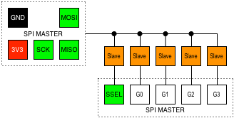
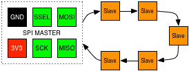

#  SPI

> The Serial Peripheral Interface bus (SPI) is a synchronous serial communication interface specification used for short distance communication, primarily in embedded systems. SPI devices communicate in full duplex mode using a master-slave architecture with a single master. The master device originates the frame for reading and writing. Multiple slave devices are supported through selection with individual slave select (SSEL) lines.

* [Wikipedia Article](https://www.wikiwand.com/en/Serial_Peripheral_Interface_Bus)

## Pin Variants

All pin variants provide an SPI interface which has a single slave select pin (`SSEL`).

If you need more slave selelects, the UX2-GPIO or UX2-ALT variants provide `Gx` (GPIO) pins that can be utilised as additional slave selectors.

Max 5 slaves; UX2-GPIO – 4 x GPIO, 1 x UART, 1 x I2C, 1 x SPI:

Max 3 slaves; UX2-ALT – 2 x GPIO, 1 x UART, 2 x I2C, 1 x SPI:

Max 1 slave; UX2-1IS – 1 x 1-WIRE, 1 x INTERRUPT, 1 x UART, 1 x I2C, 1 x SPI, 1 x SOUND-WIRE:

Max 1 slave; UX2-I2C – 3 x I2C, 1 x UART, 1 x SPI:

## Wiring

The SPI interface uses at least 6 wires (`MISO`, `MOSI`, `SCK`, `SSEL`, `3V3` and `GND`); GPIO (`Gx`) pins can be used as additional slave selects if more than one slave is required (alternatively, use the daisychain topology; see later).

| UX2                         | SPI                           |
| --------------------------- | ----------------------------- |
|  | `MISO` (master in, slave out) |
|  | `MOSI` (master out, slave in) |
|    | `SCK` (slave clock)           |
|  | `SS` (slave select)           |
|     | `SS` (use as exta `SSEL`)     |
|    | `VCC`                         |
|    | `GND`                         |

## Topology

SPI provides two network topologies...

**Linear:**

This is the most common topology; it uses one slave select (`SSEL` or `Gx` pin) per slave.

This allows direct communication with each specific slave, but only one slave can be used at a time.

**Daisychain:**

An alternate topology which arranges all slaves in a circular circuit, requiring only a single `SSEL` pin.

This topology is generally only used with combinations of devices that are designed for this mode of operation; specifically where it is beneficial to daisychain all the shift registers togheter.

## See also:

* [UX2 Overview](../../README.md)
* [Protocols Overview](../README.md)
* [Modules](../../modules/README.md)
    * [Adafruit](../../modules/adafruit/README.md)
    * [Sparkfun](../../modules/sparkfun/README.md)
    * [UEXT](../../modules/uext/README.md)
